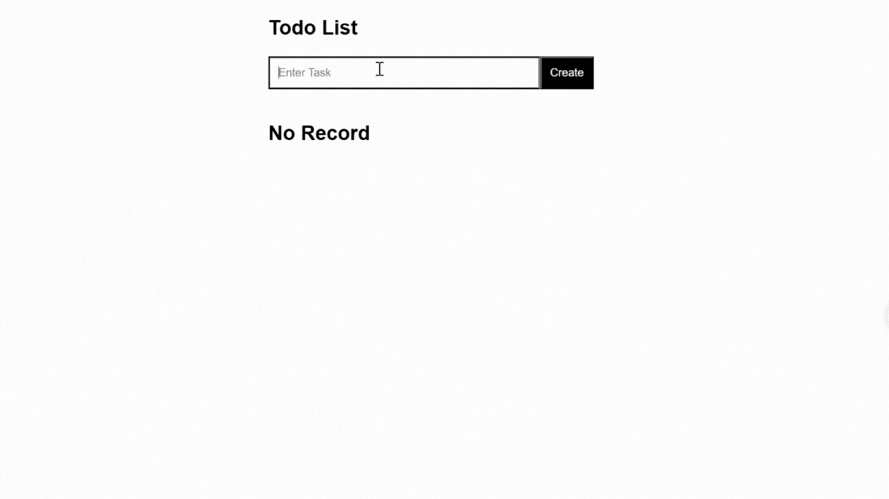

# Todo-List-in-ExpressJs-ReactJs-NodeJs-MongoDB-Scss

A Todo List application built using the MERN stack (MongoDB, Express, React, Node.js) with SCSS for styling.

## Preview
<picture></picture>

## Prerequisites

- Node.js
- npm (Node Package Manager)
- MongoDB (MongoDB Compass or MongoDB Atlas)

## Getting Started

Follow these instructions to get a copy of the project up and running on your local machine for development and testing purposes.

### Installation

1. Clone the repository:

   ```bash
   git clone "https://github.com/Sudhanshu-Ambastha/Todo-List-in-ExpressJs-ReactJs-NodeJs-MongoDB-Scss"
   ```
2. Install the dependencies:
   ```
   cd todolist
   ```
   ```
   npm install
   ```
3. Start the development server:
   ```
   npm run dev
   ```
4. Install additional dependencies:   
   ```
   npm install axios react-icons
   ```
5. Set up the server:   
   ```
   cd Server
   ```
   ```
   npm init -y
   ```
   ```
   npm install express mongoose cors
   ```
6. Install Sass for SCSS support:   
   ```
   npm install sass
   ```
7. Start the server:
   ```
   npm install nodemon
   ```
   ```
   node index.js
   ```
8. Set up MongoDB:

- Download and install [MongoDB Compass](https://www.mongodb.com/try/download/community) or set up MongoDB Atlas.

- Ensure MongoDB is running on `mongodb://127.0.0.1:27017/TodoList`.   

## Usage
- The frontend of the application is served using React.
- The backend of the application is powered by Node.js and Express.
- The database uses MongoDB to store todos.
- SCSS is used for styling.

## API Endpoints
- GET /get: Fetch all todos.
- PUT /update/:id: Mark a todo as done by ID.
- DELETE /delete/:id: Delete a todo by ID.
- POST /add: Add a new todo.

## Running the Application
1. Start the React development server:
   ```
   npm run dev
   ```
2. Start the Express server:
   ```
   cd Server
   nodemon index.js
   ```
3. Open your browser and navigate to http://localhost:3000 to see the Todo List application in action.

## Built With
- React - A JavaScript library for building user interfaces.
- Express - Fast, unopinionated, minimalist web framework for Node.js.
- Node.js - JavaScript runtime built on Chrome's V8 JavaScript engine.
- MongoDB - The NoSQL database for modern applications.
- SCSS - A CSS preprocessor that adds power and elegance to the basic language.

## File Structure
```
.
├── Server
│   ├── Models
│   │   └── Todo.js
│   ├── index.js
├── public
│   └── index.html
├── src
│   ├── components
│   │   ├── Create.jsx
│   │   └── Home.jsx
│   ├── App.scss
│   ├── App.jsx
│   └── main.jsx
├── package.json
├── README.md
└── .gitignore
```

## Setting Up MongoDB
1. Download and install [MongoDB Compass](https://www.mongodb.com/try/download/community) or set up a cloud instance using [MongoDB Atlas](https://www.mongodb.com/products/platform/atlas-database).

2. Ensure MongoDB is running on `mongodb://127.0.0.1:27017/TodoList`.

3. If using MongoDB Compass, create a new database named `TodoList` with a collection named `todos`.

